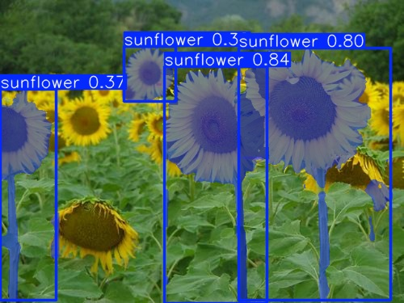
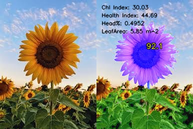

# 🌻 Sunflower Analyzer

### This tool analyzes sunflower photos using a YOLOv8 segmentation model. It scores each detected flower based on yellowness and scores surrounding vegetation based on greenness.

## 📌 Usage

```
// default values
python3 app.py image.jpg

//specify with
python3 app.py --gimbal-degree 45 --camera-height 2 --camera-distance 1.4 --land-width 7 --land-length 4.2 test.jpg
```
## examples




Head% and LeafArea values of these photos are arbitrary, intended use is with a camera Height,FOV and Distance from a land(w/h)

# 📛 Limitations
## model is small, misses most of the sunflowers
## area calculations doesn't support some angles, such as 15
## just photo, no video support implemented